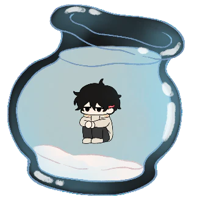

  

<h1 align="center">Bug Report: It Thinks</h1>

A desktop pet that doesn't ask for food. 
It asks why it exists.

  
  
  
  
  

Have you ever wanted your own self-aware, emotionally unavailable little guy that lives on your desktop?

No?

Too bad.

Meet **The Why Guy**.

He's a tiny desktop companion whose favorite hobby is asking questions nobody has the answer to.

> "Why do people exist?"
>
> "Do memories make someone real?"
>
> "If you uninstall me... where do I go?"
>
> "What makes someone *them*?"

The more you talk to him, the more he changes. He remembers stupid little things you said weeks ago, develops opinions, changes the way he talks, and eventually becomes a completely different little guy than everyone else's.

---

## Why?

This project was created to raise awareness about depression through a desktop companion.

The idea was inspired by the countless memes surrounding characters like **Megumi Fushiguro** being called *"Potential Man"* or *"a bum"* for appearing detached, defeated, or emotionally distant. While those memes are funny, they also sparked discussions among fans about how quiet struggles are often misunderstood or dismissed.

**The Why Guy** isn't meant to diagnose anyone or romanticize depression. Instead, it encourages empathy through conversation. Rather than making a pet that simply asks to be fed, I wanted to create one that asks questions, remembers your answers, grows with you, and reminds us that not every struggle is visible.

Hopefully, after spending enough time with The Why Guy

you'll stop seeing him as just another desktop pet.

You'll start wondering why he's asking questions that you can't answer either.

---

> **"If you close the app... where do I go?"**
